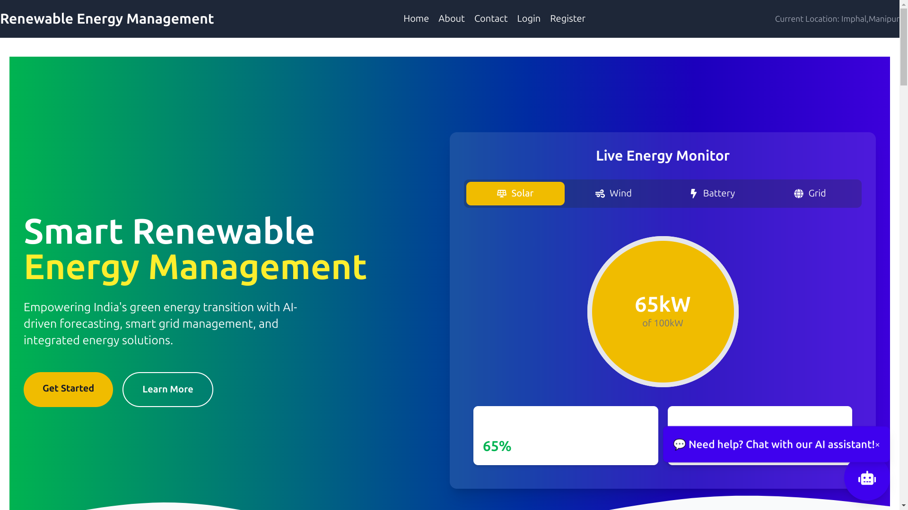
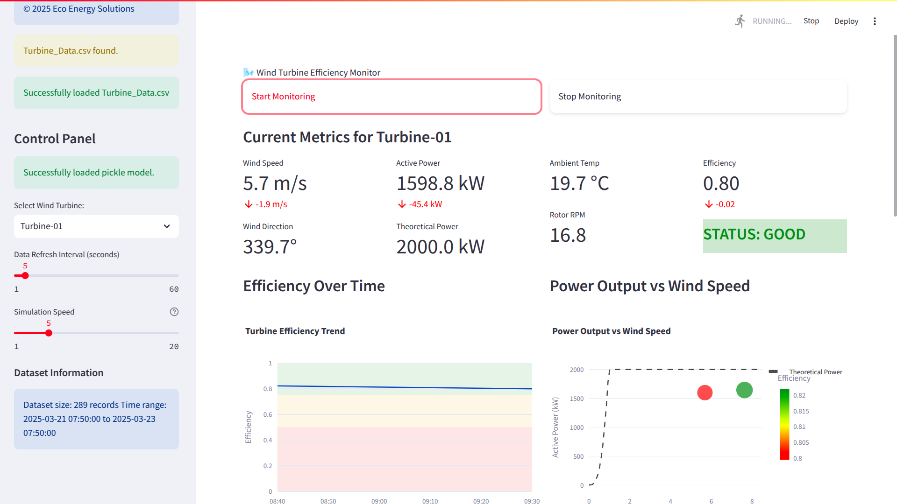

# 🌱 Control and Operation of Renewable Energy


Welcome to the **Control and Operation of Renewable Energy** project! 🌍⚡ This project is an AI-powered platform that optimizes and monitors **solar and wind energy** systems, providing real-time analytics, efficiency calculations, and forecasting.

## 🌟 Features

✔ **AI-Powered Energy Forecasting** – Uses **LSTM, XGBoost, and Scikit-learn** to predict energy generation.\
✔ **Real-time Monitoring** – Uses **WebSockets & IoT Sensors (Arduino)** for instant updates.\
✔ **Advanced Solar Calculator** – Helps in calculating panel efficiency for **residential & commercial** usage.\
✔ **Wind Turbine Performance Analysis** – Predicts and visualizes turbine performance based on real-time parameters.\
✔ **Interactive Dashboard** – Built using **Streamlit & React**, providing **live charts and analytics**.\
✔ **Backend on AWS** – Ensures scalability and **cloud-based energy computation**.\
✔ **Smart Chatbot (Mira API)** – Provides insights and recommendations on energy utilization.\
✔ **PostgreSQL Database** – Stores historical energy data for deep analysis.

## 📌 Why This Project?

Renewable energy sources like **solar and wind** are the future, but **their efficiency depends on weather, positioning, and various external factors**. This project aims to:\
✅ **Optimize energy generation** using AI-based predictions.\
✅ **Provide real-time control and operation** for maximum output.\
✅ **Help users plan better investments** in solar and wind technology.

## 🚀 Tech Stack

### **🔹 AI & Machine Learning**

- **LSTM (Long Short-Term Memory)** – Used for **time-series forecasting** of solar and wind energy.
- **XGBoost** – Helps improve energy prediction accuracy.
- **Scikit-learn** – Used for feature engineering and classification models.

### **🔹 Web & Dashboard**

- **Streamlit** – Frontend framework for **data visualization and interactive charts**.
- **React** – Enhances UI/UX with a **dynamic dashboard**.

### **🔹 Backend & API**

- **Flask** – API backend for model integration.
- **WebSockets** – Provides **real-time monitoring** of sensors.
- **PostgreSQL** – Stores energy generation data for historical analysis.

### **🔹 IoT & Cloud**

- **AWS** – Used for deployment, ensuring cloud-based analytics.
- **Arduino & Sensors** – Collect real-time **wind sped, solar irradiance, and temperature** data.

## 🔥 How It Works?

### **1️⃣ Solar Panel Efficiency Calculation**

- Takes **solar irradiance, panel tilt, and temperature** as input.
- Uses **AI models** to predict **energy output** and compare it with expected efficiency.
- Generates **performance reports**.

### **2️⃣ Wind Turbine Energy Forecasting**

- Uses **historical wind data** to predict future energy generation.
- **Compares actual vs. predicted efficiency** in real time.
- Uses **sensor-based real-time monitoring** for **fault detection**.

### **3️⃣ Real-time Monitoring Dashboard**

- Fetches **live sensor data** from wind turbines & solar panels.
- Displays **efficiency trends & AI-based recommendations**.
- Sends **alerts when performance drops** below threshold.

## 📸 Screenshots







## 🛠 Installation & Setup

To run this project on your local machine:

### **1️⃣ Clone the Repository**

```bash
 git clone https://github.com/kumar-ankit-100/Control-and-Operation-of-Renewable-Energy.git
 cd Control-and-Operation-of-Renewable-Energy
```

### **2️⃣ Set Up the Virtual Environment**

```bash
python -m venv env  # Create virtual environment
source env/bin/activate  # Activate (For Mac/Linux)
# OR
env\Scripts\activate  # (For Windows)
```

### **3️⃣ Install Dependencies**

```bash
pip install -r requirements.txt
```

### **4️⃣ Run the Streamlit App**

```bash
streamlit run app.py
```

## 📡 Deployment (AWS)

Coming Soon! (We are working on cloud integration using **AWS Lambda & EC2** for hosting the ML models.)

## 🤝 Contributing

We welcome contributions! Feel free to **fork the repo**, submit issues, or create pull requests.

1️⃣ **Fork the project**\
2️⃣ **Create a branch** (`git checkout -b feature-branch`)\
3️⃣ **Commit changes** (`git commit -m "Added new feature"`)\
4️⃣ **Push the branch** (`git push origin feature-branch`)\
5️⃣ **Open a Pull Request**

## 🏆 Hackathon Participation

This project was built as part of a **hackathon challenge** on **renewable energy operation and control**. Our goal is to **make this an open-source project**, helping researchers, engineers, and enthusiasts optimize **solar and wind energy**.


*"The future is ********renewable********. Let's make the world greener! 🌍🌿"*

📌 **GitHub Repo:** [Control and Operation of Renewable](https://github.com/kumar-ankit-100/Control-and-Operation-of-Renewable-Energy)[ Energy](https://github.com/kumar-ankit-100/Control-and-Operation-of-Renewable-Energy)


## Demo
## 🚀 Live Demo

- **Frontend:** [Vercel Deployment](https://control-and-operation-of-renewable-energy.vercel.app/)
- **AI-Powered Monitoring:** [Streamlit App](https://control-and-operation-of-renewable-energy-tx9cuvefu7wwpggprjsa.streamlit.app/)


## 👨‍💻 Authors & Contributors  

This project was collaboratively developed by a team of passionate engineers, each specializing in different aspects of renewable energy modeling and system integration.  

### 🔹 **Shreedhar Anand** ([GitHub](https://github.com/shreedhardynamiccraft))  
**Role:** Full-Stack Developer (Frontend & Backend), Solar Cost & Savings Analyst  

- Led the development of the **frontend and backend management system**, creating a user-friendly interface and ensuring smooth API interactions.  
- Designed and implemented the **dashboard for renewable energy monitoring**, enabling users to visualize real-time energy predictions and analytics.  
- Optimized the **database and API endpoints** to handle energy data efficiently.  
- Developed the **Solar Price Calculator**, an ML-powered tool that estimates **solar panel costs, energy savings, and financial benefits** based on inputs like surface area, location, and energy consumption.  
- Implemented an AI model to predict **how much energy can be saved using solar panels** and the corresponding **cost savings** over time.  

---

### 🔹 **Ankit Kumar** ([GitHub](https://github.com/kumar-ankit-100))  
**Role:** AI/ML Engineer & System Integrator  

- Developed the **solar energy determination module**, analyzing solar panel efficiency using AI models.  
- Created **AI-powered energy prediction models** to forecast energy generation based on historical and environmental data.  
- Integrated multiple components, ensuring seamless communication between **solar, wind, and management systems**.  
- Implemented **real-time AI predictions** into the **Streamlit** and **React-based dashboard**.  

---

### 🔹 **Ram Ashish Yadav** ([GitHub](https://github.com/ramashishyadav108))  
**Role:** Wind Energy Specialist & IoT Developer  

- Built **wind energy prediction models**, trained on large datasets to estimate power generation.  
- Enabled **real-time monitoring and data acquisition** using **Arduino and IoT sensors** for wind turbine efficiency tracking.  
- Integrated sensor-based **live data streaming** into the system, improving energy forecasting accuracy.  
- Optimized **model training and deployment**, making wind energy predictions faster and more accurate.  

---

🚀 **Special Thanks to All Contributors!**  
This project is a result of dedicated teamwork, leveraging AI, ML, and IoT for smarter renewable energy management.  


